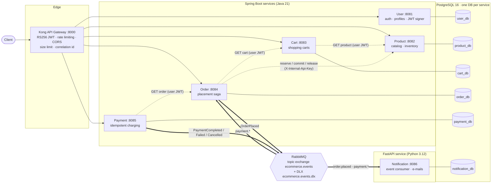
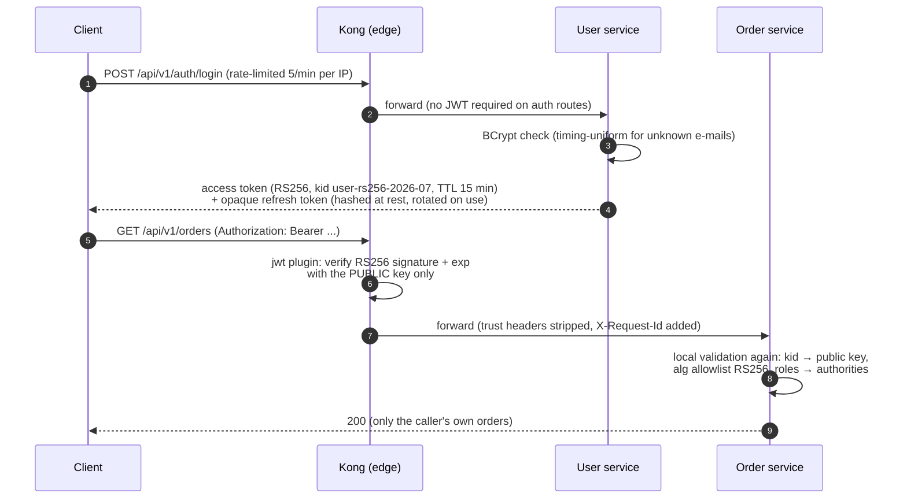
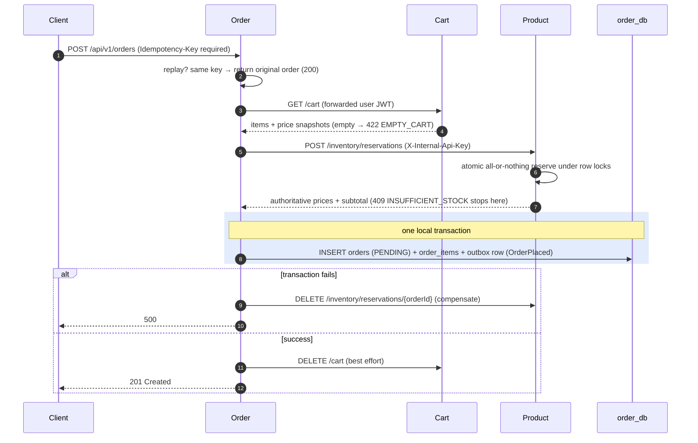
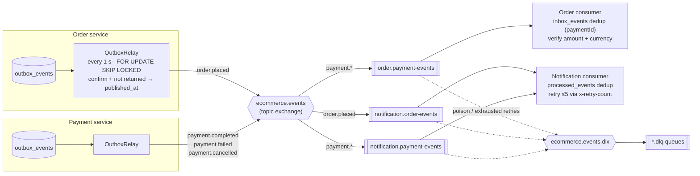
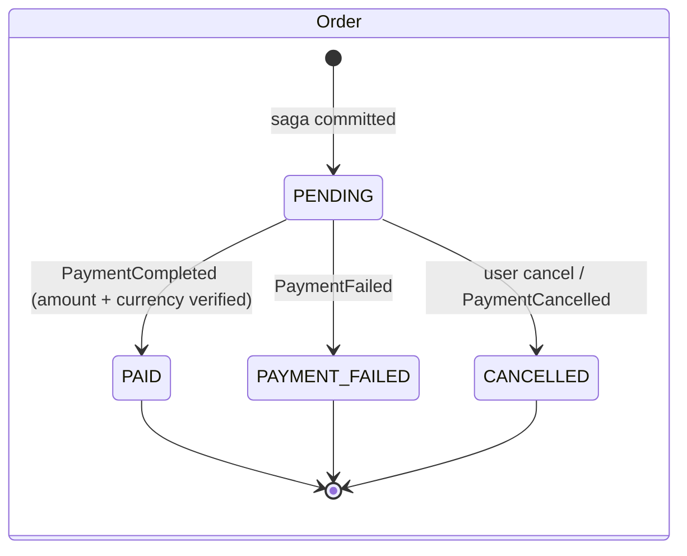
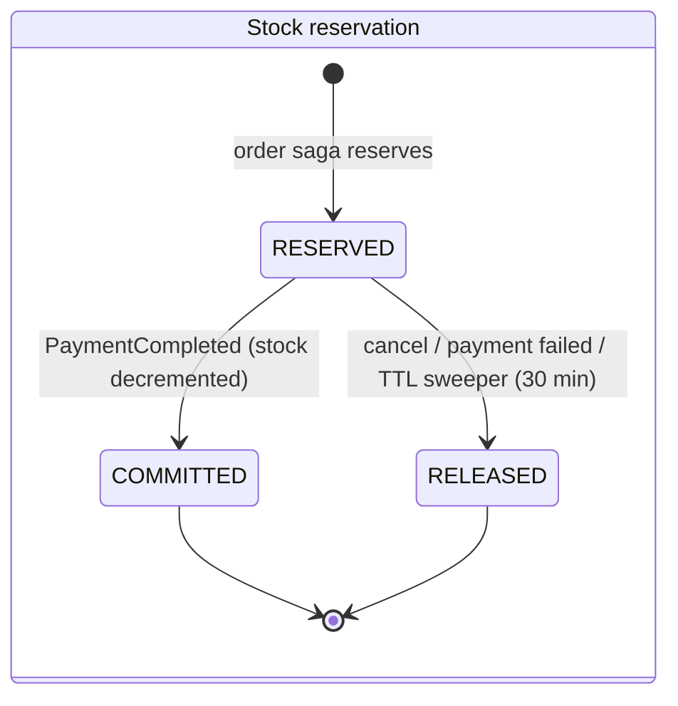
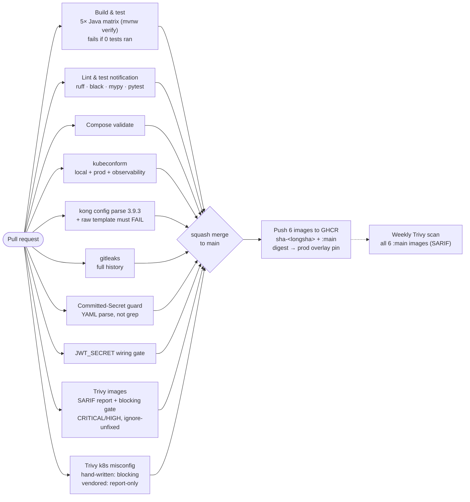

<h1 align="center">E-Commerce Microservices Platform</h1>

<p align="center">
  <a href="https://github.com/andrei-sili/ecommerce-microservices/actions/workflows/ci.yml"></a>
  
  
  
  
  
  
  
</p>

<p align="center">
  Event-driven e-commerce backend built as a <b>production-style system</b>, not an MVP:<br>
  contract-first APIs, asymmetric JWT, transactional outbox, idempotent payments,<br>
  unmocked integration tests and a CI pipeline with real security gates.
</p>

<p align="center">
  <b>6</b> services · <b>6</b> databases · <b>5</b> domain events · <b>10</b> CI gates · <b>55+</b> pull requests · <b>0</b> secrets in the repo
</p>

---

## Architecture

All business traffic enters through a single edge (Kong `:8000`). Every service owns its
database (database-per-service), state changes cross service boundaries only through REST
calls or RabbitMQ events, and no application container or database publishes a host port.



| Service | Stack | Port | Database | Responsibility |
|---|---|---|---|---|
| **user** | Spring Boot 3 | 8081 | `user_db` | Registration, login, refresh-token rotation, profiles. Sole RS256 signer. |
| **product** | Spring Boot 3 | 8082 | `product_db` | Public catalog + categories, stock with atomic reservations (TTL + sweeper). |
| **cart** | Spring Boot 3 | 8083 | `cart_db` | Per-user carts with server-side price snapshots. |
| **order** | Spring Boot 3 | 8084 | `order_db` | Placement saga, order lifecycle, outbox publisher, payment-event consumer. |
| **payment** | Spring Boot 3 | 8085 | `payment_db` | Idempotent charging, HMAC-verified webhook, outbox publisher. |
| **notification** | FastAPI | 8086 | `notification_db` | Pure consumer: turns events into (sandbox) e-mails. No public route. |

## Authentication: RS256 with defense in depth

One private key, held only by the user service. Everyone else, including Kong, verifies
with the public key, so a compromised leaf service can never forge a token.



Claims are exactly `iss`, `sub`, `roles`, `iat`, `exp`: never PII. Service-to-service
calls forward the end-user JWT (Cart→Product, Order→Cart, Payment→Order); the only
system-level path (Order→Product inventory) uses a separate `X-Internal-Api-Key` that
Kong never exposes, and `/api/v1/inventory/*` plus the payment webhook simply have no
edge route at all.

## Order placement: a compensated saga

The client sends an empty body. Items and prices come from the server-side cart and the
inventory reservation, so nothing the client says is trusted.



## Event backbone: transactional outbox, done properly

Events are written to `outbox_events` **in the same transaction** as the state change,
then drained by a scheduled relay. The subtle part: a broker *confirm* only proves the
exchange accepted the message; a topic exchange silently drops unroutable messages. So a
row is marked published only when the publish is **confirmed AND not returned**
(publisher confirms + mandatory flag), otherwise it stays in the outbox and is retried.



Delivery is at-least-once, so every consumer is idempotent: dedup keys are the stable
domain ids (`orderId`, `paymentId`) stored in inbox tables, and the ack happens only
after the dedup row and the side effect commit together.

| Event | Routing key | Publisher | Consumers |
|---|---|---|---|
| `OrderPlaced` | `order.placed` | Order | Notification |
| `PaymentCompleted` | `payment.completed` | Payment | Order, Notification |
| `PaymentFailed` | `payment.failed` | Payment | Order, Notification |
| `PaymentCancelled` | `payment.cancelled` | Payment | Order, Notification |
| `UserRegistered` | `user.registered` | User (outbox only, relay pending) | Notification (deferred) |

## Lifecycles

Money and stock are state machines with terminal states and no shortcuts. The order
service only marks an order `PAID` after re-verifying amount and currency against the
consumed `PaymentCompleted` event; a mismatch goes to the DLQ, never to `PAID`.





Payments mirror this: `PENDING → SUCCEEDED | FAILED | CANCELLED`, driven either by the
synchronous gateway call or by the HMAC-SHA256-verified webhook, each transition emitting
its domain event exactly once. A DB-level partial unique index guarantees at most one
`SUCCEEDED` payment per order, so a double charge is impossible even under races.

## API surface

Everything lives under `/api/v1`, JSON, snake_case bodies (events are camelCase). Every
error uses one envelope: `{"error": "CODE", "message": "...", "timestamp": "...", "path": "..."}`,
and a client mistake is never a 500. Lists are paginated (`content`, `page`, `size`,
`total_elements`, `total_pages`).

<details>
<summary><b>Endpoints by service</b> (click to expand)</summary>

| Method + path | Auth | Purpose |
|---|---|---|
| `POST /api/v1/auth/register` | public | create account (emits `UserRegistered`) |
| `POST /api/v1/auth/login` | public, 5/min per IP | issue token pair |
| `POST /api/v1/auth/refresh` | public | rotate refresh token |
| `GET · PUT /api/v1/users/me` | JWT | own profile |
| `PUT /api/v1/users/me/password` | JWT | change password, revoke all refresh tokens |
| `GET /api/v1/products` · `GET /{id}` | public | catalog, search, pagination |
| `POST · PUT · DELETE /api/v1/products` | ADMIN | manage catalog (soft delete) |
| `GET · POST /api/v1/categories` | public / ADMIN | categories |
| `GET · PATCH /api/v1/products/{id}/inventory` | public / ADMIN | stock view / stock delta |
| `POST · DELETE /api/v1/inventory/reservations` | internal key | reserve / release (no edge route) |
| `POST /api/v1/inventory/reservations/{id}/commit` | internal key | commit stock on payment |
| `GET /api/v1/cart` + item routes | JWT | cart with quantity caps and price snapshots |
| `POST /api/v1/orders` | JWT + Idempotency-Key | placement saga |
| `GET /api/v1/orders` · `GET /{id}` | JWT | own orders only, no existence leaks |
| `PATCH /api/v1/orders/{id}` | JWT | cancel (idempotent) |
| `POST /api/v1/payments` | JWT + Idempotency-Key | charge (no amount in body: server reads the order) |
| `GET /api/v1/payments/{id}` | JWT | payment status |
| `POST /api/v1/payments/webhook` | HMAC signature | gateway callback, blocked at the edge |

</details>

## Security model

- **RS256 only.** The signing key exists in exactly one container. Kong and all five
  Java services validate with the public key; a CI gate (`jwt-secret-gate`) fails any PR
  that reintroduces `JWT_SECRET` wiring.
- **No secret ever committed.** Kong's config embeds a public key, so the repo tracks
  only a template with an intentionally invalid placeholder; `render-kong.sh` injects
  the key per deployment and fails closed. CI proves the un-rendered template is
  rejected by `kong config parse`.
- **Edge hardening.** Per-route JWT, login brute-force cap (5/min), global 120/min per
  IP, 5 MB body limit, CORS allowlist, spoofable trust headers stripped, webhook and
  internal APIs unreachable from outside.
- **Money safety.** Idempotency keys on orders and payments, replay returns the original
  outcome without re-charging, webhook events deduplicated by gateway event id, amounts
  re-verified server-side.
- **Least privilege.** The Java service containers run non-root (notification hardening
  is pending), Kong admin API is never
  published, K8s pods do not automount service-account tokens, CI workflows get
  read-only `GITHUB_TOKEN` plus narrowly scoped per-job permissions.

## CI/CD pipeline

Ten jobs on every PR; images are built and pushed only after merge, then re-scanned weekly.



Every third-party action is pinned to a full commit SHA (a 2026 supply-chain attack on a
popular action made this non-negotiable), and the Trivy CLI version itself is pinned to a
known-good release.

## Testing philosophy

A green suite that verified nothing is worse than a red one, so the rules are structural:

- **Testcontainers, not mocks**, for integration tests: real PostgreSQL and RabbitMQ.
- **Every cross-service seam has at least one unmocked test** (WireMock at the HTTP
  level), because method-level mocks encode assumptions, not contracts.
- **Per-path tests**: happy, replay/idempotency, decline, validation, and abuse cases
  (foreign ids, missing `Bearer`, forged webhook signatures, duplicate events).
- **"0 tests ran" fails CI**: a self-skipping suite cannot pretend to be green.

## Run it

**Docker Compose** (requires Docker; under 5 minutes):

```bash
git clone https://github.com/andrei-sili/ecommerce-microservices && cd ecommerce-microservices
cp infra/.env.example infra/.env            # fill local values
bash infra/scripts/render-kong.sh           # dev keypair + rendered Kong config (required)
docker compose -f infra/docker-compose.yml up --build
```

Business traffic: `http://localhost:8000` (Kong). RabbitMQ UI: `http://localhost:15672`.
An end-to-end auth smoke test over every route: `bash infra/scripts/edge-smoke.sh`.

<details>
<summary><b>Kubernetes (k3d) + observability</b></summary>

```bash
make -C infra k8s-up        # k3d cluster, 14 pods, Kong via NodePort on :8000
make -C infra k8s-validate  # kustomize build | kubeconform (local, prod, observability)
make -C infra k8s-down      # deletes the cluster (data loss)
```

The k8s stack mirrors Compose (same service DNS names), adds Postgres StatefulSets, and
ships an observability layer: Prometheus + Grafana (kube-prometheus-stack) scraping all
eight targets (5× Spring actuator, FastAPI, RabbitMQ, Kong) with pre-baked dashboards,
plus Loki + Alloy for logs. Prod overlay pins images by GHCR digest.

```bash
kubectl -n ecommerce port-forward svc/kube-prometheus-stack-grafana 3000:80
```

</details>

## Repository layout

```
services/
  user/          Spring Boot: auth, profiles, RS256 signing, outbox
  product/       Spring Boot: catalog, inventory reservations, TTL sweeper
  cart/          Spring Boot: carts, price snapshots
  order/         Spring Boot: placement saga, outbox relay, payment consumer
  payment/       Spring Boot: charging, webhook, outbox relay
  notification/  FastAPI: RabbitMQ consumer, inbox dedup, e-mails
infra/
  docker-compose.yml   14 containers, single ingress
  kong/                declarative gateway config (template + render script)
  k8s/                 kustomize base + local/prod overlays + observability
.github/workflows/     ci.yml · push-images.yml · scheduled-image-scan.yml
```

## Process

Solo project run with team discipline: every endpoint and event was specified in a
contract **before** implementation, work shipped as small vertical slices through
**55+ pull requests**, each squash-merged only on green CI. The architecture grew in
waves (Compose → gateway → events → Kubernetes → RS256 edge validation → observability),
and every incident along the way was distilled into a rule the pipeline now enforces.
